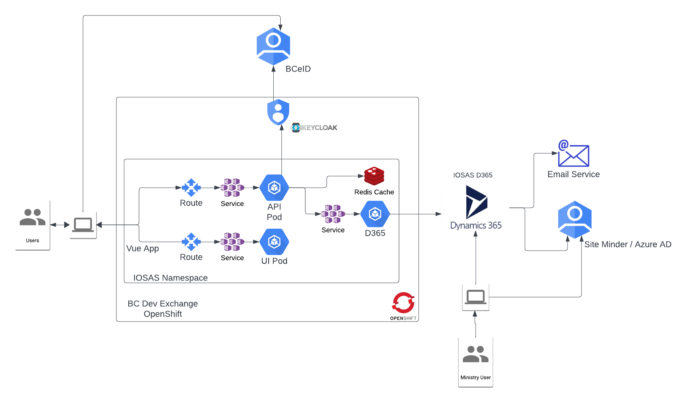
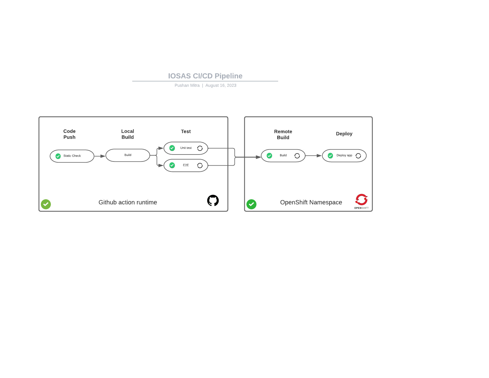

# Independent School Online Application System (IOSAS), Ministry of Education and Child Care


## Overview

The Independent School Online Application System (IOSAS) is a public-facing web portal powered by the Ministry of Education and Childcare (MOECC), BC, CA. The platform is designed to streamline the submission of Independent School Applications as well as Expressions of Interest (EOI). To leverage its services, users are required to create a BCeID, which serves as the identity provider for this web application. 

Via the portal, applicants can manage and track the statuses of their EOIs and school applications. The platform is built using a robust tech stack with Vue.js deployed for front end operations, ensuring a seamless and interactive user interface. Node.js is utilized for the integration middleware, enhancing end-to-end system operations.

The critical data including EOIs and School applications are stored and processed using MS D365, managed by BC's government, ensuring secure and efficient data handling. The endpoint communication with MS D365 is done using Web REST API, assuring fast and secure data transfer. The system uses MOECC managed KeyCloak for Identity Access Management (IAM) services, which handles the authentication and authorization sessions with the integration middleware. Furthermore, all user session information is securely stashed inside an internal Redis Server.

In essence, the IOSAS web portal is a one-stop solution for Independent School Applications and EOI submissions, offering a fluid, secure, and efficient user experience.

## Technical Stack

### Frontend

IOSAS web portal is build in **Vue.js**

### Integration Middleware (backend)

The integration middleware developed in **NodeJs**. And **Redis** is used as authetication session storage. 

### MS Dynamic 365 as Backend

The application data ans state is saved in MS Dynamic 365. The integration middleware connects MS D365 using REST WEB API.

### Indentity and authetication managment (IAM)

Keycloak, managed by MOECC, is used as IAM.

## Architecture Diagram



## Application Security: Protected API Acess


## Local Deployment Guide for Web Application

This guide provides instructions for setting up the web application locally, including the backend, frontend, and necessary integrations such as Redis for session management and MS D365 for enterprise resource planning.

### Prerequisites

- Docker installed (for running Redis locally)
- Node.js v18 or higher
- npm (Node Package Manager)
- Access to OpenShift development environment (for Redis and MS D365 container deployment)

### Redis Setup

Redis is used for storing user sessions. It can be deployed locally using Docker, directly installed, or connected to a Redis instance deployed on an OpenShift development environment.

#### Local Deployment with Docker

1. Pull the Redis image from Docker Hub:

   ```bash
   docker pull redis
   ```

2. Run the Redis container:

   ```bash
   docker run --name local-redis -p 6379:6379 -d redis
   ```

#### Local Direct Installation

For direct installation instructions, refer to the official Redis documentation: [Redis Quick Start](https://redis.io/topics/quickstart).

#### Using Redis on OpenShift

To connect to a Redis instance deployed on OpenShift, change to `/tools` and run following command

```bash
make redis-tunnel
```

Alternatively, to disable Redis, adjust the settings in `local.json`.

### MS D365 Integration

The application requires MS D365 integration. While it's possible to run this locally, we recommend using `oc port-forward` to connect to a container deployed on the OpenShift development environment for ease of use and stability. Change to `/tools` and run following command

```bash
make d365-api-tunnel
```

### Backend Setup

To run the backend (integration middleware), follow these steps:

1. Change to the backend directory:

   ```bash
   cd /backend
   ```

1. Create a `local.json` file under `src/config` with the necessary configurations. One sample local.json file is available under Githhub repo root/Setting/Secret and variables/Actions/Variables/LOCALJSON

```json
{
  "server": {
    "frontend": "http://localhost:8081",
    "logLevel": "info",
    "morganFormat": "dev",
    "port": "8080",
    "saveSession": "false"
  },
  "tokenGenerate": {
    "privateKey": "***",
    "publicKey": "<KEY***>",
    "audience": "TEST AUDIENCE",
    "issuer": "TEST ISSUER"
  },
  "oidc": {
    "discovery": "https://soam-dev.apps.silver.devops.gov.bc.ca/auth/realms/IOSAS/.well-known/openid-configuration",
    "publicKey": "<KEY***>",
    "clientId": "iosas-dev",
    "clientSecret": "f33f9c38-5fb0-4172-b17a-7b92106914e1"
  },
  "redis": {
    "host": "localhost",
    "port": 6379,
    "password": "********"
  },
  "logoutEndpoint": "https://soam-dev.apps.silver.devops.gov.bc.ca/auth/realms/master/protocol/openid-connect/logout",
  "siteMinder_logout_endpoint": "https://logontest7.gov.bc.ca/clp-cgi/logoff.cgi?retnow=1&returl=",
  "scheduler": {
    "schedulerCronProfileRequestDraft": "0 0 0 * * *",
    "numDaysAllowedInDraftStatus": 7,
    "expectedDraftRequests": 200,
    "numDaysAllowedInReturnStatusBeforeEmail": 5,
    "numDaysAllowedInReturnStatusBeforeAbandoned": 7
  },
  "d365": {
    "host": "localhost"
  }
}

```

1. Install Node.js dependencies:

   ```bash
   npm ci
   ```

   Or:

   ```bash
   npm install
   ```

1. Start the server:

   ```bash
   npm run serve
   ```

   The server will be up and running on port 4000.

### Frontend Setup

To set up the frontend, execute the following steps:

1. Change to the frontend directory:

   ```bash
   cd /frontend
   ```

2. Install the Node.js dependencies:

   ```bash
   npm ci
   ```

   Or:

   ```bash
   npm install
   ```

3. Run the web server:

   ```bash
   npm run serve
   ```

## Deployment Guide for Web Application in OpenShift

This README provides instructions for deploying and configuring a web application in OpenShift using the provided Makefile. The guide covers everything from setting up Redis to deploying web and API components, including integration with Microsoft Dynamics 365 (D365).

### Prerequisites for OpenShift Deployment

- OpenShift CLI (oc) installed and configured
- Access to an OpenShift cluster with the necessary permissions
- Git for version control operations
- Login to Openshift using `oc login`

### Configuration

Ensure you have a `.env` file located in the parent directory of the Makefile with all required environment variables defined. These variables include namespaces for development, test, and production environments, application name, and various keys and URLs for D365 and Redis integration.

### Deployment Steps

#### Initial Setup

- **Configure OpenShift Namespace**:

  ```bash
  make init-oc
  ```
  
  Configures the OpenShift namespace according to the `ENV_PREFIX` and other environment variables.

- **Configure API ConfigMap and Secret**:

  ```bash
  make init-api-config
  ```

  Creates and configures the ConfigMap and secret necessary for the API.

#### Building and Deploying the API

- **Build API Container Image**:

  ```bash
  make oc-build-api
  ```

  Builds the API container image in the OpenShift tools namespace.

- **Deploy API Application**:

  ```bash
  make oc-deploy-api
  ```

  Deploys the API application to the configured OpenShift namespace.

#### Building and Deploying the Web App

- **Build Web Container Image**:

  ```bash
  make oc-build-web
  ```

  Builds the web container image in the OpenShift tools namespace.

- **Deploy Web Application**:

  ```bash
  make oc-deploy-web
  ```

  Deploys the web application to the configured OpenShift namespace.

#### Redis Deployment

- **Deploy Redis**:

  ```bash
  make deploy-redis
  ```

  Deploys Redis within the specified OpenShift namespace.

### D365 API Tunnel

- **Port Forwarding for D365 API**:

  ```bash
  make d365-api-tunnel
  ```

  Sets up port forwarding to the D365 API service.

### Additional Commands

- **Port Forwarding for Redis**:

  ```bash
  make redis-tunnel
  ```

- **Get UI URL**:

  ```bash
  make get-ui-url
  ```

- **Get Current OpenShift Namespace**:

  ```bash
  make get-oc-namespace
  ```

- **Tagging and Promotion**:
  Commands for tagging commits (`make tag-commit`) and promoting builds (`make promote-web`) are also included.

### Note for Openshift Deployment

This guide outlines the steps to deploy and configure the web application within an OpenShift environment, including Redis setup, API and web deployments, and D365 integration. Adjustments to the `.env` file and Makefile variables may be necessary to align with your specific deployment context.

## CI/CD Pipeline README for Web Application

This README outlines the Continuous Integration and Continuous Deployment (CI/CD) process for a web application, managed through GitHub Actions and deployed on OpenShift. The CI/CD pipeline is designed to automate the build and deployment process, ensuring that every change is seamlessly integrated and deployed to the development environment, with options for manual deployments and promotions.

### Overview of CI/CD

The CI/CD pipeline utilizes GitHub Actions to automate the building and deploying of the application. It is configured to respond to push events to specific branches and manual triggers, with each OpenShift build tagged with the Git commit SHA for traceability.

#### General Workflow Diagram



#### Workflows

##### Automatic Build and Deployment to Development Environment

- **Development Workflow**: The `dev` workflow is triggered on a push event to the `main-dev` branch. It automatically builds and deploys the entire application to the development environment. This process is defined under `.github/workflows/dev.yml`.

###### Manual Build and Deployment

- **API Deployment**: To manually build and deploy the API component in the development environment, the `dev-api` workflow is used. This can be triggered manually through GitHub Actions and is defined in `.github/workflows/dev-api.yml`.

- **Web Deployment**: Similar to the API, the `dev-web` workflow allows for the manual build and deployment of the web component in the development environment. This is available through GitHub Actions and is defined in `.github/workflows/dev-web.yml`.

###### Promotion to Target Environment

- **Promotion Workflow**: The `promote-any` workflow facilitates the promotion of a build to any target environment. It can use either a specific build tag (commit SHA) if the Git branch head points to the same commit SHA, or it can use the latest tag if the Git branch head points to a SHA whose build tag is not available. This workflow is defined under `.github/workflows/promote-any.yml` and must be triggered manually.

#### Tagging Strategy

Each build deployed to OpenShift is tagged with the Git commit SHA. This tagging strategy ensures traceability and allows for precise promotions between environments.

#### Triggering Manual Workflows

To trigger manual deployments or promotions:

1. Go to the repository on GitHub.
2. Navigate to the **Actions** tab.
3. Select the desired workflow (e.g., `dev-api`, `dev-web`, or `promote-any`).
4. Click the **Run workflow** dropdown.
5. Choose the branch where the workflow is defined.
6. Click **Run workflow** to start the process.

#### Note for CI/CD

This CI/CD pipeline automates the process of integrating, building, and deploying applications to various environments. It leverages GitHub Actions for both automatic and manual workflows, ensuring that the application remains up-to-date and stable across all development stages.

## Reusable Templates

This repository contains multiple OpenShift templates that can be used to instantly spin up builds, deployments, and pipelines. These templates can be found in the [templates folder](https://github.com/bcgov/EDUC-EDX/tree/master/tools/templates).

## Documentation

- [Openshift Readme](openshift/README.md)

## Getting Help or Reporting an Issue

To report bugs/issues/features requests, please file an [issue](https://github.com/bcgov/ECC-IOSAS/issues).

## License

    Copyright 2020 Province of British Columbia

    Licensed under the Apache License, Version 2.0 (the "License");
    you may not use this file except in compliance with the License.
    You may obtain a copy of the License at

       http://www.apache.org/licenses/LICENSE-2.0

    Unless required by applicable law or agreed to in writing, software
    distributed under the License is distributed on an "AS IS" BASIS,
    WITHOUT WARRANTIES OR CONDITIONS OF ANY KIND, either express or implied.
    See the License for the specific language governing permissions and
    limitations under the License.
